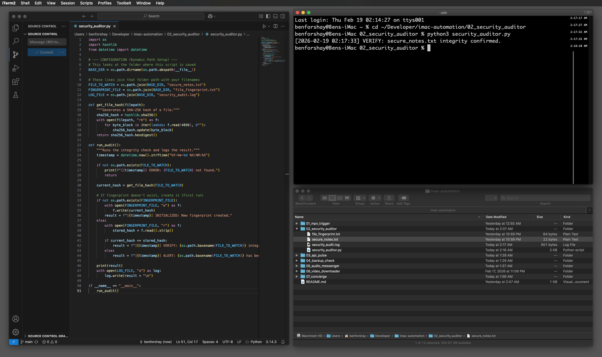
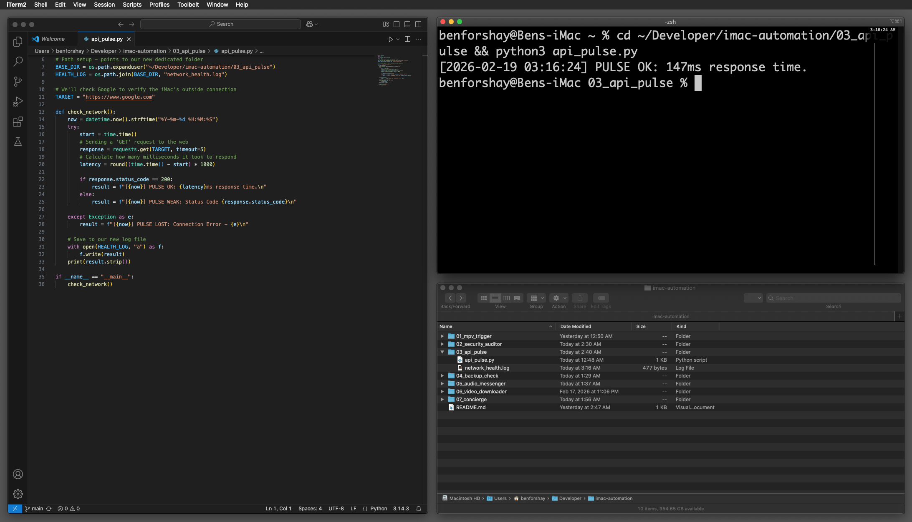
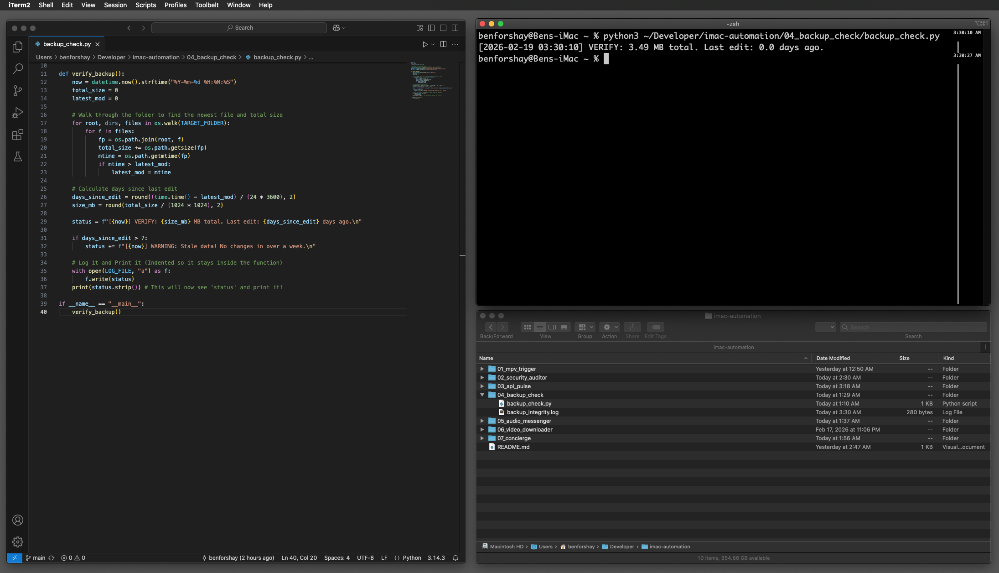
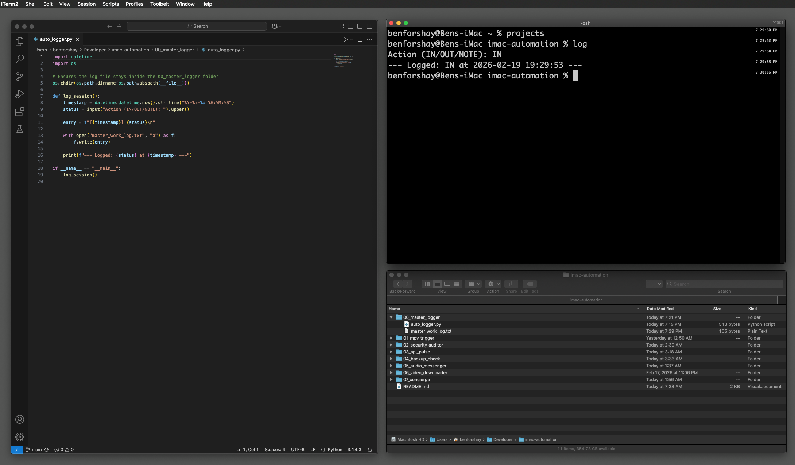
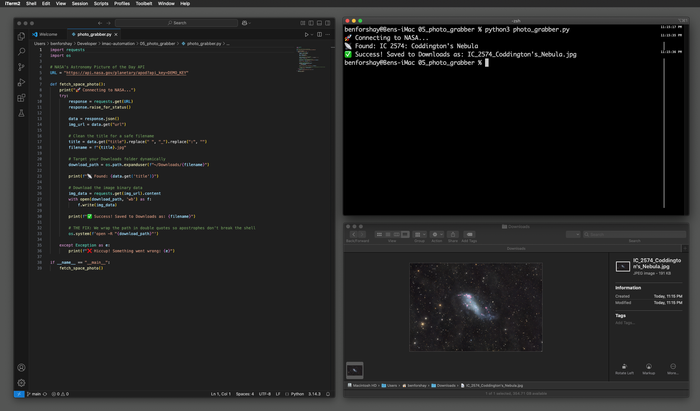

# iMac Automation & Sync

## Project 1: The mpv Music Button
- **Status:** Logic Complete / Desktop Shortcut Pending.
- **Features:** Python-based web audio player using `mpv`.
- **Tools:** Python 3, Homebrew, GitHub Tokens, macOS (Catalina & Monterey).

## Technical Wins Today:
- **Security:** Fixed SSL certificates for Python web requests.
- **Sync:** Established seamless workflow between iMac and MacBook Air.
- **Logic:** Implemented active command handling for 'stop' signals.
- **Automation:** Created a custom `play` alias for the terminal.

## Project Proof

  
## Project 2: Video Downloader
- **Status:** Functional / Optimizing GUI.
- **Features:** Python-based media downloader with native audio support.
- **Tools:** Python 3, `yt-dlp`, Homebrew.

## Technical Wins Today:
- **Efficiency:** Successfully separated audio streams for high-quality downloads.
- **Organization:** Integrated into the global `imac-automation` sync.

## Project Proof

## 🛠️ Project 3:  The iMac Automation Trilogy

A collection of three core Python scripts designed to monitor system health and security.

### 1. Security Auditor
* **Purpose**: Scans for valid security certificates and permission errors.
* 

### 2. API Pulse
* **Purpose**: Logs network latency and verifies external connectivity.
* 

### 3. Backup Integrity
* **Purpose**: Tracks file size changes and verifies last-modified timestamps.
* 

## Project 4:  Master Auto-Logger
A central utility to track session start and end times across all automation tasks.

**Execution Proof:**

---
## 05 | NASA Photo Grabber
**Status:** Complete ✅  
**Tech:** Python, NASA Web API, macOS Terminal  

An automated script that reaches out to NASA's servers to grab the "Astronomy Picture of the Day." It handles dynamic file paths and protects against shell syntax errors during the download process.

