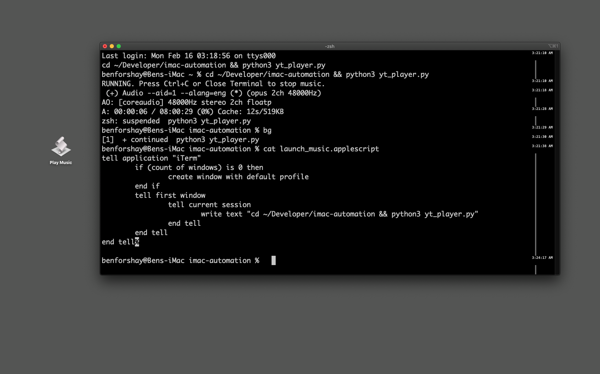
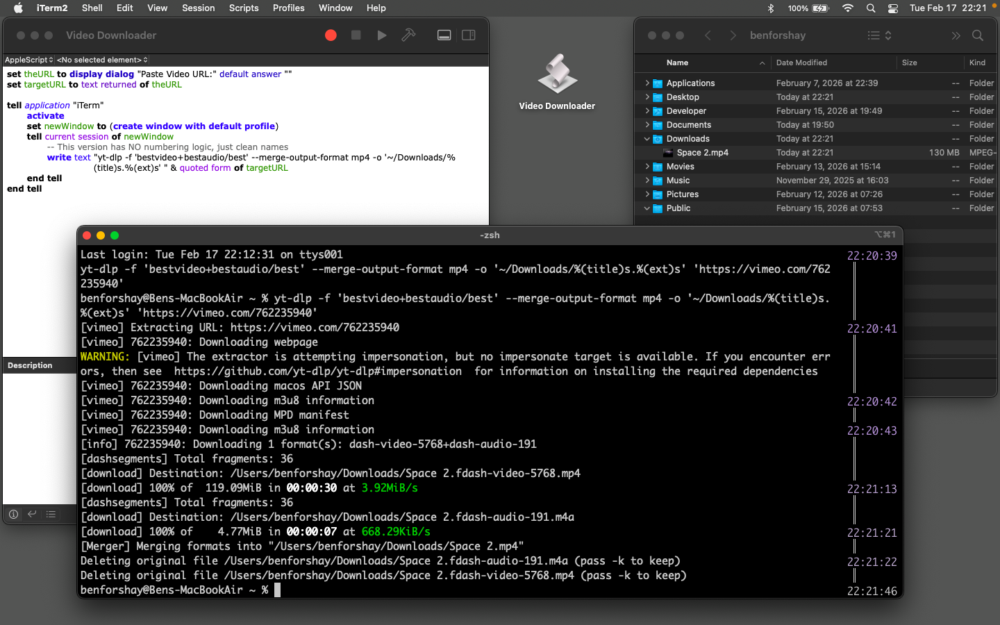

# iMac Automation & Sync

## Project 1: The mpv Music Button
- **Status:** Logic Complete / Desktop Shortcut Pending.
- **Features:** Python-based YouTube audio player using `mpv`.
- **Tools:** Python 3, Homebrew, GitHub Tokens, macOS (Catalina & Monterey).

## Technical Wins Today:
- **Security:** Fixed SSL certificates for Python web requests.
- **Sync:** Established seamless workflow between iMac and MacBook Air.
- **Logic:** Implemented active command handling for 'stop' signals.
- **Automation:** Created a custom `play` alias for the terminal.

## Project Proof

  
## Project 2: Video Downloader
- **Status:** Functional / Optimizing GUI.
- **Features:** Python-based YouTube downloader with native audio support.
- **Tools:** Python 3, `yt-dlp`, Homebrew.

### Technical Wins Today:
- **Efficiency:** Successfully separated audio streams for high-quality downloads.
- **Organization:** Integrated into the global `imac-automation` sync.
